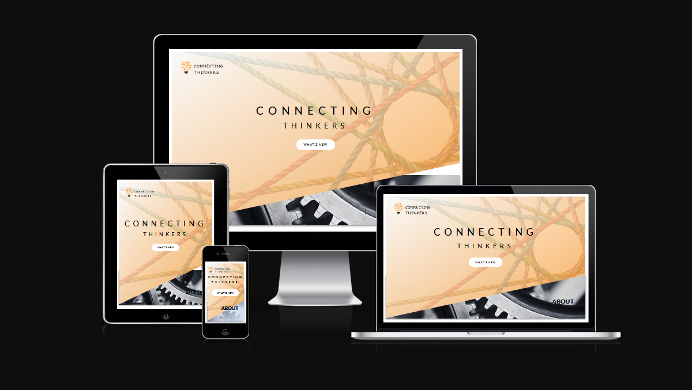

# CONNECTING THINKERS
 “Connecting Thinkers” is a website directed at those who like to keep abreast of topical issues.  Information is provided by our debaters in a captivating manner and in a unique and innovative format.
Every week, a new subject is uploaded in the Connecting Thinkers’ Arena, and two professionals with
different expertise and backgrounds will debate the subject. You can easily access our latest content by clicking in the “What's New” button above or by scrolling down to the Arena section.

Nowadays, people have become more politicised and are speaking their minds as never before. Depending on
their beliefs and personal interests, the flow of information they receive can be compromised and partial. 
According to Michael Altshuler - an American Author and Speaker on  Business leadership - the “… bad news is time flies.  The good news is you’re the pilot”. You have the power to decide where you go to get reliable information.

The manner in which we use our time and the sources we select to inform ourselves can determine our deepest thoughts and existence and this can influence us positively or not. 

In the ancient past, Greek philosophers  were known for their excellent time management and for building their knowledge across many different areas of education such as maths, the sciences, speech, and writing.  This broad base of understanding made them amazing debaters.

Connecting Thinkers follows the same logical reasoning to bring you a quality debate presenting different ‘Thinkers’ points of view and background. 

Here in this section our current time is displayed as a reminder to use your time wisely.

The debaters will discuss the subject and you can check afterwards how much information you retained by playing our quiz.

Deployed site link: [CONNECTING THINKERS](https://felipeseiberlich.github.io/connecting-thinkers/)

## UX
The design of ‘Connecting Thinkers’ is inspired by the cogs, representing the brain; by the ropes that connect spaces and tie ideas together; by the light bulb representing knowledge and ideas; by the Greek bust representing our reference back to the early Greek philosophers; and by the boxing ring representing a modern arena. 

The varied  movements and animation applied to the titles and buttons on the Connecting Thinkers websites references that different opinions should meet in the middle and that knowledge can emanate from waves of information.

The navigation was designed so that the user can easily move to any part of the landing and quiz pages. The links are intentionally displayed in the diagonal to reference for one more time that extremities in positions can be linked and to provide a clean and harmonic layout.

### Colour Scheme
In the early stages of the project, I envisioned a contrast between tones of orange, black and grey. In the middle of the project lavender was added to the scheme color palette to represent freshness and joy.

My inspiration for the “Connecting Thinkers” website is based on the visuals of complementary colours; by the elegance of black and white for the background headings and pages; and by utilising the eye catching ‘Davy's grey’ for the general text.
- `#000000` used for primary text.
- `#E84610` used for primary highlights.
- `#4A4A4F` used for secondary text.
- `#009FE3` used for secondary highlights.
I used [coolors.co](https://coolors.co/e84610-009fe3-4a4a4f-445261-d63649-e6ecf0-000000) to generate my colour palette.

 
I've used CSS `:root` variables to easily update the global colour scheme by changing only one value, instead of everywhere in the CSS file.
```css
:root {
    --hue-neutral: hsl(0, 0%, 100%);
    --hue-correct: rgba(56, 236, 56);
    --hue-wrong: rgb(248, 47, 47);
}
```
### Typography
The font-family selected for 'Connecting Thinkers' body and  Headings is "Lato, sans-serif" and for the logo is "Cursive" a typographic style that is appealing and clear.
- [Lato](https://fonts.google.com/specimen/Lato) was used for the body text and headings.
- [Cursive](https://fonts.google.com/specimen/Montserrat) was used for the logo text.
 
## Features
‘Connecting Thinkers’ website is composed of 2 pages – the Index and the Quiz. The landing page contains a header, an about section that leads to the following sections, the Our History section, the Arena section, and the footer. The Quiz page contains the logo, a card box displaying the quiz and a footer.

The Index Page
The Index Page has a compound background image bounding a vibrant color with a dark monochromatic one, showing that differences can live side by side. The navigation can be made throughout the header. The logo leads the user to the Quiz page, the ‘What’s new’ button displayed in the center of the header leads them to the Arena section and the About button leads the users to Our History section.
The ‘Our History’ section explains the concept behind the 'Connecting Thinkers' website and the current date, day, and time as a reminder for users to use their time wisely.
In the following section the users can find our Arena, the place we present our debaters of the week and their professions. The debate can be watched by the users in the center of the Arena with an expandable video linked to the YouTube platform.
The footer displays a button that leads the user all the way up to the page's header and the copyright mark positioned to the right.
 
The header
The header shows the logo followed by the website's name - 'Connecting Thinkers', displayed in black capitals, one of the main colours of the website's palette.
The index webpage is displayed in almost full viewport but allows the user to scroll down to the other sections or to click in the linked button, image, and text to be transported to different parts of the webpage.
The Connecting Thinkers tittle present in the header has an intended animation applied to it as reference that different opinions should meet in the middle and the button below effects that knowledge needs to emanate like waves.
Finally, the header is connected to the About section which displays a link leading the users to the following section - 'Our History'.
The About section
The About section was created with the intention to be connected to the header and to lead the users to the following section with a click. These two bounded sections provide the users with efficient navigation to all sections of the webpage. As elucidated before, the background image was selected with the intention to neatly contrast with the header’s color and background and to make a reference to the thought process in the brain represented by the cogs. The text displayed in this section changes its color to orange when hovered over by the users.
The Our History section
The ‘Our History’ section contains some vital information about the site, about the 'Connecting Thinkers' creation process and the frequency of new content. One of 'Connecting Thinkers' references goes back in time to the great Greek Philosophers like Aristotle and Plato. A Greek bust decorates this section followed by our current date, time, and hour. This functionality was integrated to the website as a reminder to the users to use their time wisely.
This section was designed like a flash card following the concept that knowledge comes with hard work, dedication, and education.

The Arena section
The Arena section has an important role in this website. It hosts the debate and presents the week’s debaters. The concept of creating an arena echo the Ancient Roman Empire, where gladiators used to fight for their lives as the emperor’s entertainment to the people.
'Connecting Thinkers' modernizes this concept through a boxing ring so the debaters can intellectually “fight” to keep their point of view alive.
On the top of the background image there is a heading which contains the week’s subject.  This is displayed in a subtle purple colour animation to create a visual contrast. Every week a new subject, a new video, and new debaters will be selected to compose this panel.
Like in the Roman Empire, users can be entertained by a Quiz clicking on the 'Do you know?' button and an external page will display the game.
The Footer
The footer has its background colour in black and hosts the copyright and a function button that brings the users back to the top of the page.

### Existing Features
- **Back to top button**
- Having a "back to top" button on a website is important. It allows users to easily scroll back to the top of the page. Java Script was used for this addition.

- **Display current date and time**
- Even though most personal devices will display the current date and time, the “Connecting Thinkers” website brings this feature into the center of the page, side-by-side with the main text. The golden ratio was applied as the human eye can process this faster and it can induce a pleasurable response by the user. 

- **Quiz**
- This feature is an important addition to the website because it offers users an interactive way of solidifying their knowledge.


### Future Features
In the future I would like to include the following features:
- Video gallery
    - A space reserved for all videos published by Connecting Thinkers.
- Flash cards
    - In the ‘Our History’ section, I would like to include a text carrousel simulating a flash card.
- Quiz total score
    - I would like to add the user's total score in the end of the game.

## Tools & Technologies Used
I have listed below all of the tools and technologies used to develop the “Connecting Thinkers” Website.
- [HTML](https://en.wikipedia.org/wiki/HTML) was used for the main site content.
- [CSS](https://en.wikipedia.org/wiki/CSS) was used for the main site design and layout.
- [CSS :root variables](https://www.w3schools.com/css/css3_variables.asp) was used for reusable styles throughout the site.
- [CSS Flexbox](https://www.w3schools.com/css/css3_flexbox.asp) was used for an enhanced responsive layout.
- [CSS Grid](https://www.w3schools.com/css/css_grid.asp) was used for an enhanced responsive layout.
- [JavaScript](https://www.javascript.com) was used for user interaction on the site.
- [Git](https://git-scm.com) was used for version control. (`git add`, `git commit`, `git push`)
- [GitHub](https://github.com) was used for secure online code storage.
- [GitHub Pages](https://pages.github.com) was used for hosting the deployed front-end site.
- [Gitpod](https://gitpod.io) was used as a cloud-based IDE for development.

## Testing
For all testing, please refer to the [TESTING.md](TESTING.md) file.

## Deployment
The site was deployed to GitHub Pages as follows:
- In the [GitHub repository](https://github.com/FelipeSeiberlich/connecting-thinkers), navigate to the Settings tab
- From the source section drop-down menu, select the **Main** Branch, then click "Save".
- The page will be automatically refreshed with a detailed ribbon display to indicate the successful deployment.
The live link can be found [here](https://felipeseiberlich.github.io/connecting-thinkers)

### Local Deployment
This project can be cloned or forked in order to make a local copy on your own system.

#### Cloning
You can clone the repository by following these steps:
1. Go to the [GitHub repository](https://github.com/FelipeSeiberlich/connecting-thinkers)
2. Locate the Code button above the list of files and click it
3. Select if you prefer to clone using HTTPS, SSH, or GitHub CLI and click the copy button to copy the URL to your clipboard
4. Open Git Bash or Terminal
5. Change the current working directory to the one where you want the cloned directory
6. In your IDE Terminal, type the following command to clone my repository:
    - `git clone https://github.com/FelipeSeiberlich/connecting-thinkers.git`
7. Press Enter to create your local clone.
Alternatively, if using Gitpod, you can click below to create your own workspace using this repository.
[](https://gitpod.io/#https://github.com/FelipeSeiberlich/connecting-thinkers)
Please note that in order to directly open the project in Gitpod, you need to have the browser extension installed.
A tutorial on how to do that can be found [here](https://www.gitpod.io/docs/configure/user-settings/browser-extension).

#### Forking
By forking the GitHub Repository, we make a copy of the original repository on our GitHub account to view and/or make changes without affecting the original owner's repository.
You can fork this repository by using the following steps:
1. Log in to GitHub and locate the [GitHub Repository](https://github.com/FelipeSeiberlich/connecting-thinkers)
2. At the top of the Repository (not top of page) just above the "Settings" Button on the menu, locate the "Fork" Button.
3. Once clicked, you should now have a copy of the original repository in your own GitHub account!

### Local VS Deployment
No significant changes were detected between the local developed version and the live deployed site on GitHub Pages.

## Credits
I would like to credit [Canva](https://www.canva.com/) for all imaginary and video used on [Connecting Thinkers](https://felipeseiberlich.github.io/connecting-thinkers/)
website. I also would like to credit [W3Schools](https://www.w3schools.com/) and [Flexbox Froggy](https://flexboxfroggy.com/) for helping me with the development of Connecting Thinkers' second and third sections.
In relation to the README.md file, I would like to credit [Tim Nelson](https://github.com/TravelTimN) for developing this amazing tool [Markdown Builder by Tim Nelson](https://traveltimn.github.io/markdown-builder) used to help generate the Markdown files. This generator provides guidance to the students in providing well structured
documentation.

### Content
| Link | Location | Notes |
| --- | --- | --- |
| [Markdown Builder by Tim Nelson](https://traveltimn.github.io/markdown-builder) | README and TESTING | tool to help generate the Markdown files |
| [Flexbox Froggy](https://flexboxfroggy.com/) | Responsive Nav Bar | "Create a responsive navigation nav with no JS!" |
| [W3Schools](https://www.w3schools.com/css/css_navbar.asp) | Navigation bar | responsive HTML/CSS navbar |
| [Code Institute](https://learn.codeinstitute.net) | Flexbox |

### Media
Find below a list of attribution links to all images and videos files borrowed from online.
| Link | Location | Type | Notes |
| --- | --- | --- | --- |
| [Favico.ico](https://www.favicon.cc/) | entire site | image | favicon on all pages |
| [Canva](https://www.canva.com/) | entire site | image and video | Video in the Index page and imaginary in the home page |

### Acknowledgements
- I would like to thank my Code Institute mentor, [Tim Nelson](https://github.com/TravelTimN) for his support throughout the development of this project.
- I would like to thank my Code Institute mentor, [Rahul Lakhanpal](https://github.com/RahulLakhanpal) for his support throughout the development of this project.
- I would like to thank the [Code Institute Slack community](https://code-institute-room.slack.com) for the moral support.
- I would like to thank the Student Care Agent Kim, for their assistance.
