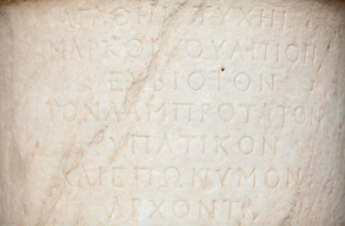

# CONNECTING THINKERS

 “Connecting Thinkers” is a website directed at those who like to be on top of the news. The information is 
provided in a captive way from our debaters in a unique and innovative format.

Every week, a new subject is uploaded in the Connecting Thinkers’ Arena, and two professionals with
different expertise and background will debate about the same subject. You can easily access our latest
content clicking in the What's New button above or scrolling down to the Arena section.

Nowadays, people is becoming more politicized and speaking their minds as never before. Depending on 
their beliefs and personal interesting, the information vehicles can be seriously compromised with partiality.
According to Michael Altshuler - an American Author and Speaker about Business leadership - the “Bad news is time flies.
The good news is you’re the pilot”. You have the power to decide from where to get reliable information.

The way we use our time and the source we select to feed our brains can determine our deepest thoughts and existence
and this can influence us positively or not. In the past, the Greek philosophers for example were very well known for
their excellent time management skills and knowing how to grow their knowledge in different areas of actuation as math, sciences, 
speech, languages, and this mix of understanding made them amazing debaters.

Connecting Thinkers follows the same logical reasoning to bring you a quality debate crossing over different “Thinkers” 
point of view and background. Here in this section our current time is displayed as a reminder to use your time wisely.
The debaters will discuss the subject and you can check afterwards how much information you retained playing our quiz game.



Deployed site link: [CONNECTING THINKERS](https://felipeseiberlich.github.io/connecting-thinkers/)

## UX
‘Connecting Thinkers’ design is inspired by the cogs, representing our brain’s function, by the ropes that connect spaces and tight things up, by the bulb lamp representing the knowledge and ideas, by the Greek buster representing our reference to the Greek philosophers and by the boxing ring representing a modern arena. Following the variety of movements and animation applied to the titles and buttons at Connecting Thinkers website, the reference is that different opinions should meet in the middle and knowledge needs to emanate as waves.
The navigation was designed in a way that the user could be easily taken to any part of the landing and quiz pages. The links are displayed intentionally in the diagonal to reference one more time that extremities can be linked and to provide a clean and harmonic layout.

### Colour Scheme
In the early stages of the project, I envisioned a nice contrast between tones of orange black and grey. In the middle of the project the lavender was added to the scheme color palette to bring freshness and joy . 
My inspiration for Connecting Thinkers website was based on the visuals of complementary colours, by the elegance of black and white for the headings and page's background and the eye catching Davy's grey for general text.

- `#000000` used for primary text.
- `#E84610` used for primary highlights.
- `#4A4A4F` used for secondary text.
- `#009FE3` used for secondary highlights.

I used [coolors.co](https://coolors.co/e84610-009fe3-4a4a4f-445261-d63649-e6ecf0-000000) to generate my colour palette.


I've used CSS `:root` variables to easily update the global colour scheme by changing only one value, instead of everywhere in the CSS file.
```css
:root {
    --hue-neutral: hsl(0, 0%, 100%);
    --hue-correct: rgba(56, 236, 56);
    --hue-wrong: rgb(248, 47, 47);
}
```
### Typography
The font-family selected for 'Connecting Thinkers' body is Lato, sans-serif and for the Headings Oswad, sans-serif a typographic style that is appealing and clear.
Example:
🛑🛑🛑🛑🛑 END OF NOTES (to be deleted) 🛑🛑🛑🛑🛑
- [Montserrat](https://fonts.google.com/specimen/Montserrat) was used for the primary headers and titles.
- [Lato](https://fonts.google.com/specimen/Lato) was used for all other secondary text.
- [Font Awesome](https://fontawesome.com) icons were used throughout the site, such as the social media icons in the footer.

## Features
‘Connecting Thinkers’ website is composed by 2 pages – the Index and the Quiz game. The landing page contains a header, an about section, the Our History section, the Arena section, and the footer. The Quiz game page contains the logo, a card displaying the game and a footer.
The Index Page
The Index Page has a compound background image bounding a very vibrant color with a monochromatic one, showing that differences can live side by side. The navigation can be made throughout the header. The logo image links the user to the Quiz game page, the ‘What’s new’ button displayed in the center of the header links to the Arena and the About button leads the user to Our History.
The ‘Our History’ section display the concept of the Connecting Thinkers website and the current date, day, and time as a reminder for users to use their time wisely.
In the following section the users can find our Arena, the place we present our debaters of the week and their following professions. The debate can be watched by the users in the center of the Arena with an expandable video.
The footer displays a button that leads the user all the way up to the page's header and the copyright mark.
 
The header
The header shows the logo followed by the website's name, Connecting Thinkers, presented in black capitals, one of the main colours of the website's palette. 
The index webpage is displayed in almost full viewport but allows the user to scroll down to the other sections or to click in the linked button, image, and text to reach them.
The Connecting Thinkers tittle present in the header has an intended animation applied to it as reference that different opinions should meet in the middle and the button bellow effects that knowledge needs to emanate.
Finally, the header is connected to the About section that display a linked text leading the users to the following section.
The About section
The About section was created with the intention to be connected to the header and to lead the users to the following section with a click. These two sections bounded provide the users an efficient navigation to all sections and side page. As elucidated before the background image was selected with the intention to nicely contrast with the header’s color and background and to make a reference of the brain function represented by the cogs. The text displayed in this section changes its color to orange when hovered over by the users.
The Our History section
The ‘Our History’ section contains some vital information about the page itself, about the Connecting Thinkers creation process the frequency of videos uploads. One of Connecting Thinkers references goes back in time until the great Greeks Philosophers like Aristotle and Plato. A Greek bust statue decorates this section following by our current date, time, and hour. This functionality was integrated to the website to reminder the users to use their time wisely.
This section was designed like a flash card following the concept of knowledge comes with hardwork, dedication and education.
The Arena section
The Arena section has an important role in this website. It hosts the debate and presents the week’s debaters. The concept of creating an arena transcend the Ancient Roman Empire, where gladiators used to fight for their lives while the emperor provides entertainment to the people.
Connecting Thinkers in the other hand modernized the concept bringing a box ring so the debaters can intellectually “fight” to keep their point of view alive.
On the top of the background image, a heading contains the week’s subject, and it is displayed in a subtle purpled colour animation to create a visual contrast. Every week a new subject, a new video and new debaters will be selected and added to this panel.
After or before the intellectual nourishment, users can be entertained by a quiz game clicking on the “Do you know?” Button and an external page will display the game.
The Footer 
The footer has its background colour in black and hosts the copyright and a function button that brings the users to the top of the page

### Existing Features
- **Back to top button**
- Having a "back to top" button on a website is important. It allows users to easily scroll back to the top of the page. Java Script was used for this addition.

- **Display current date and time**
- Even that most of devices has the current date and time displayed, Connecting Thinkers website brings this feature in the center of the page side-by-side the main text. The golden ratio was applied so the human eye can process it faster and that causes our brain to feel pleased.

- **Quiz game**
- This feature is an important addition to the website because offer the users an interactive way of solidifying their knowledge. 

### Future Features
In the future I would like to include the following features:
- Video gallery
    - A space reserved to all videos published by Connecting Thinkers.
- Flash cards
    - In the Our history section, I would like to include a text carrousell simulating a flash card. 
- Quiz total score
    - I would like to add the user's total score in the end of the game.

## Tools & Technologies Used
I have listed bellow all tools and tecnologies used to develop Neglected Things Website.

- [HTML](https://en.wikipedia.org/wiki/HTML) used for the main site content.
- [CSS](https://en.wikipedia.org/wiki/CSS) used for the main site design and layout.
- [CSS :root variables](https://www.w3schools.com/css/css3_variables.asp) used for reusable styles throughout the site.
- [CSS Flexbox](https://www.w3schools.com/css/css3_flexbox.asp) used for an enhanced responsive layout.
- [CSS Grid](https://www.w3schools.com/css/css_grid.asp) used for an enhanced responsive layout.
- [JavaScript](https://www.javascript.com) used for user interaction on the site.
- [Git](https://git-scm.com) used for version control. (`git add`, `git commit`, `git push`)
- [GitHub](https://github.com) used for secure online code storage.
- [GitHub Pages](https://pages.github.com) used for hosting the deployed front-end site.
- [Gitpod](https://gitpod.io) used as a cloud-based IDE for development.

## Testing
For all testing, please refer to the [TESTING.md](TESTING.md) file.

## Deployment
The site was deployed to GitHub Pages. The steps to deploy are as follows:
- In the [GitHub repository](https://github.com/FelipeSeiberlich/connecting-thinkers), navigate to the Settings tab 
- From the source section drop-down menu, select the **Main** Branch, then click "Save".
- The page will be automatically refreshed with a detailed ribbon display to indicate the successful deployment.
The live link can be found [here](https://felipeseiberlich.github.io/connecting-thinkers)

### Local Deployment
This project can be cloned or forked in order to make a local copy on your own system.

#### Cloning
You can clone the repository by following these steps:
1. Go to the [GitHub repository](https://github.com/FelipeSeiberlich/connecting-thinkers) 
2. Locate the Code button above the list of files and click it 
3. Select if you prefer to clone using HTTPS, SSH, or GitHub CLI and click the copy button to copy the URL to your clipboard
4. Open Git Bash or Terminal
5. Change the current working directory to the one where you want the cloned directory
6. In your IDE Terminal, type the following command to clone my repository:
    - `git clone https://github.com/FelipeSeiberlich/connecting-thinkers.git`
7. Press Enter to create your local clone.
Alternatively, if using Gitpod, you can click below to create your own workspace using this repository.
[](https://gitpod.io/#https://github.com/FelipeSeiberlich/connecting-thinkers)
Please note that in order to directly open the project in Gitpod, you need to have the browser extension installed.
A tutorial on how to do that can be found [here](https://www.gitpod.io/docs/configure/user-settings/browser-extension).

#### Forking
By forking the GitHub Repository, we make a copy of the original repository on our GitHub account to view and/or make changes without affecting the original owner's repository.
You can fork this repository by using the following steps:
1. Log in to GitHub and locate the [GitHub Repository](https://github.com/FelipeSeiberlich/connecting-thinkers)
2. At the top of the Repository (not top of page) just above the "Settings" Button on the menu, locate the "Fork" Button.
3. Once clicked, you should now have a copy of the original repository in your own GitHub account!

### Local VS Deployment
No significant changes were detected between the local developed version and the live deployed site on GitHub Pages.

## Credits
I would like to credit [Canva](https://www.canva.com/) for all imaginary and video used on [NEGLECTED THINGS](https://felipeseiberlich.github.io/neglected-things)
website. I also would like to credit [W3Schools](https://www.w3schools.com/) and [Kevin Powell YouTube channel](https://www.youtube.com/) for helping me with the development of Neglected Things' Nav bar and animations using the transition element.
In relation to the README.md file, I would like to credit [Tim Nelson](https://github.com/TravelTimN) for developing this amazing tool [Markdown Builder by Tim Nelson](https://traveltimn.github.io/markdown-builder) used to help generate the Markdown files. This generator provides guidance to the students in providing well structured
documentation.

### Content
| Link | Location | Notes |
| --- | --- | --- |
| [Markdown Builder by Tim Nelson](https://traveltimn.github.io/markdown-builder) | README and TESTING | tool to help generate the Markdown files |
| [Kevin Powell YouTube channel](https://www.youtube.com/watch?v=8QKOaTYvYUA) | Responsive Nav Bar | "Create a responsive navigation nav with no JS!" |
| [W3Schools](https://www.w3schools.com/css/css_navbar.asp) | Navigation bar | responsive HTML/CSS navbar |
| [Code Institute](https://learn.codeinstitute.net) | About/Steps section | how to use float |
| [Code Institute](https://learn.codeinstitute.net) | Forms | how to create forms |

### Media
Find bellow a list of attribution links to all images and videos files borrowed from online.

| Link | Location | Type | Notes |
| --- | --- | --- | --- |
| [Favico.ico](https://www.favicon.cc/) | entire site | image | favicon on all pages |
| [Canva](https://www.canva.com/) | entire site | image and video | Video in the Index page and imaginary in the home page |
| [Font Awesome](https://fontawesome.com) | Footer and About/Steps sections | Icon | Icons of chess pieces |

### Acknowledgements
- I would like to thank my Code Institute mentor, [Tim Nelson](https://github.com/TravelTimN) for his support throughout the development of this project.
- I would like to thank the [Code Institute](https://codeinstitute.net) tutor team for their assistance with troubleshooting and debugging some project issues.
- I would like to thank the [Code Institute Slack community](https://code-institute-room.slack.com) for the moral support.
- I would like to thank my best friend (Nailla Santos), for believing in me, and allowing me to make this transition into software development.