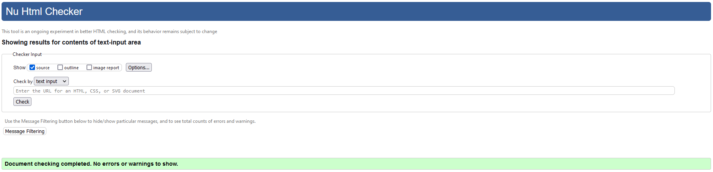
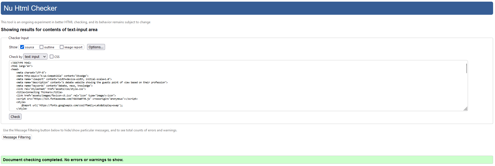
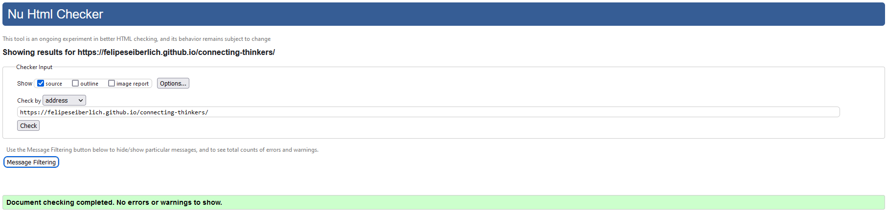
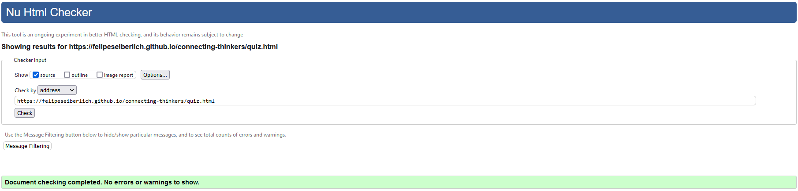
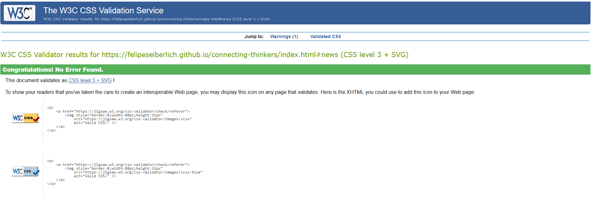
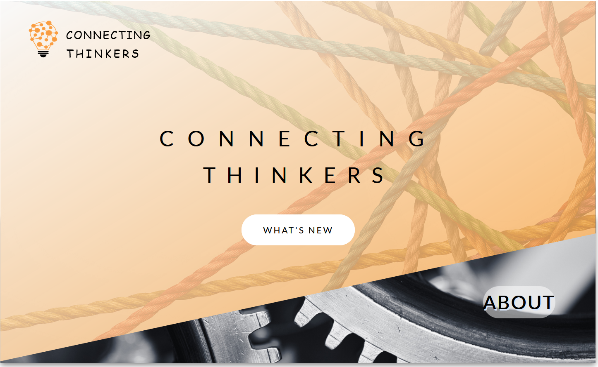
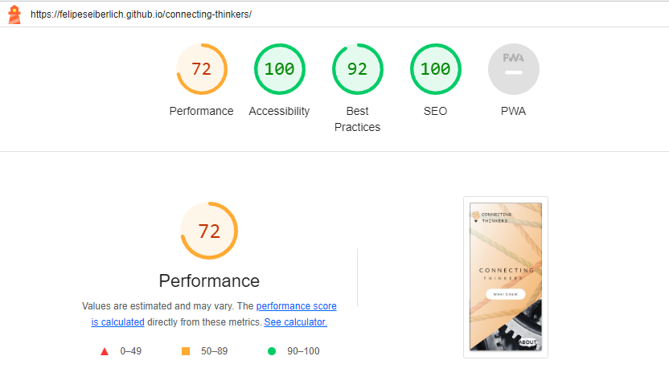
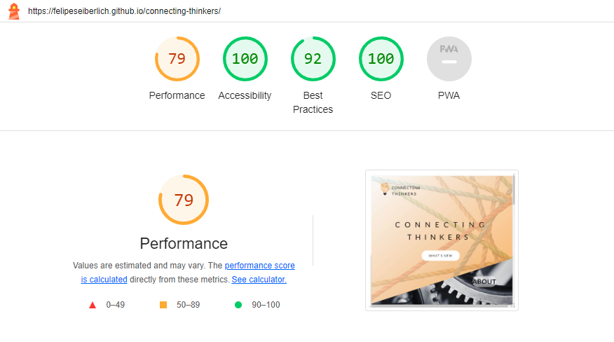
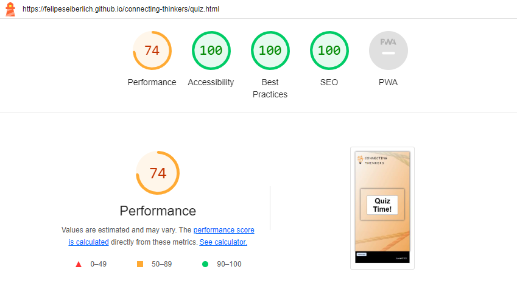
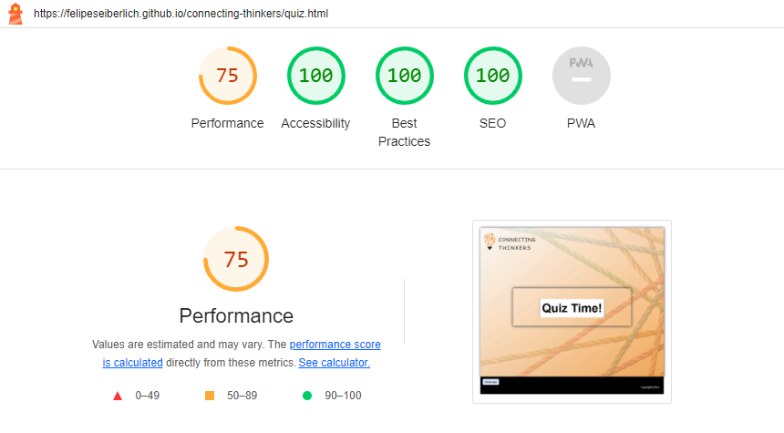

# Testing

Return back to the [README.md](README.md) file.

[CONNECTING THINKERS'](https://felipeseiberlich.github.io/connecting-thinkers/) website was methodicaly and consistenly tested and re-tested 
to assure the best user experience. Code validation, browser compatibility, responsiveness, lighthouse audit and Git hub issues ('bugs') 
were included in this testing process to comply with W3C standards. 

## Code Validation

I decided to validate [CONNECTING THINKERS'](https://felipeseiberlich.github.io/connecting-thinkers/) local code and the live site pages as
shown bellow.

### HTML

I have used the recommended [HTML W3C Validator](https://validator.w3.org) to validate all of my HTML files.

### Local file by input

#### index.html file

#### quiz.html file

### Live deployed site pages

All HTML pages were validated as shown bellow.

| Page | W3C URL | Screenshot | Notes |
| --- | --- | --- | --- |
| Index | [W3C](https://validator.w3.org/nu/?showsource=yes&doc=https%3A%2F%2Ffelipeseiberlich.github.io%2Fconnecting-thinkers%2F) | | Pass: No Errors |
| Quiz | [W3C](https://validator.w3.org/nu/?showsource=yes&doc=https%3A%2F%2Ffelipeseiberlich.github.io%2Fconnecting-thinkers%2Fquiz.html) |  | Pass: No Errors |

### CSS

I have used the recommended [CSS Jigsaw Validator](https://jigsaw.w3.org/css-validator) to validate all of my CSS files.

['CONNECTING THINKERS'](https://felipeseiberlich.github.io/connecting-thinkers/) was validated using local code and the live site pages as
shown bellow.

### Local CSS file by input

### Live deployed site

| File | Jigsaw URL | Screenshot | Notes |
| --- | --- | --- | --- |
| style.css | [Jigsaw](https://jigsaw.w3.org/css-validator/validator?uri=https%3A%2F%2Ffelipeseiberlich.github.io%2Fconnecting-thinkers%2Findex.html%23news&profile=css3svg&usermedium=all&warning=1&vextwarning=&lang=en) |  | Pass: No Errors |

## Browser Compatibility

[Chrome](https://www.google.com/chrome), [Firefox (Developer Edition)](https://www.mozilla.org/firefox/developer) and [Edge](https://www.microsoft.com/edge)
were selected to check ['CONNECTING THINKERS'](https://felipeseiberlich.github.io/connecting-thinkers/) browser compatibility.

I've tested my deployed project on multiple browsers to check for compatibility issues.
- [Chrome](https://www.google.com/chrome) presented minor CSS differences in the overall page.
- [Firefox (Developer Edition)](https://www.mozilla.org/firefox/developer) works as expected.
- [Edge](https://www.microsoft.com/edge) presented minor CSS differences in the viewport, a horizontal scroll bar was added .
- [Safari](https://www.apple.com/safari/) presented some CSS differences on the (Index page and Quiz page), where a button is displayed rounded.

## Responsiveness

['CONNECTING THINKERS'](https://felipeseiberlich.github.io/connecting-thinkers/) live/deployed site was meticulously tested for the following device types:
- Mobile
- Tablet
- Desktop
- XL Monitor

I've tested my deployed project on the aforementioned devices to check for responsiveness issues.

| Device | Screenshot | Notes |
| --- | --- | --- |
| Mobile (DevTools) |  | Works as expected |
| Tablet (DevTools) |  | Works as expected |
| Desktop |  | Works as expected |
| XL Monitor |  | Some scaling has minor issues |

## Lighthouse Audit

All ['CONNECTING THINKERS'](https://felipeseiberlich.github.io/connecting-thinkers/) pages were tested for mobile and desktop versions.
I've tested my deployed project using the Lighthouse Audit tool to check for any major issues.

| Page | Size | Screenshot | Notes |
| --- | --- | --- | --- |
| Index | Mobile |  | Few warnings |
| Index | Desktop |  | Some minor warnings |
| Quiz | Mobile |  | Some minor warnings |
| Quiz | Desktop |  | Some minor warnings |

## Bugs

There are no remaining bugs that I am aware of.
